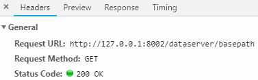
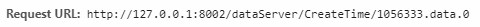
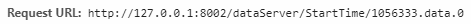
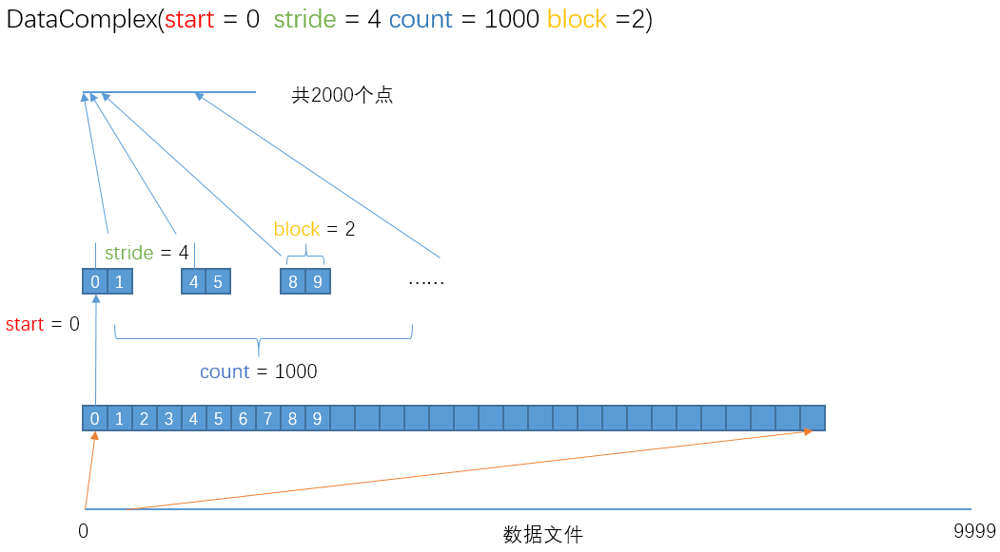

CFET DataServer数据接口说明文件

使用HTTP协议的GET方法（Web
API），可以从运行了CFET2Server程序的主机上读取CFET支持的数据采集文件中（包括HDF5）的数据。包括两大类的数据：

1、**double[]类型**，也就是原始数据（可切片）及其对应时间轴；

2、**单个数值类型**，也就是原始数据的metadata（如采样率，总点数等）

使用HTTP的Request Header即可获取对应数据（不分大小写）

下面的说明基于以下设定条件（条件可变）：

运行了CFET2Server程序的主机IP地址与端口为127.0.0.1:8002

数据文件完整路径为

C:\\Users\\BrightstarKing\\Desktop\\Server\\1056333\\data.hdf5

其中有”0”，”1”，“2“，”3”四个通道

**（1）获取数据文件根路径**

http://127.0.0.1:8000/dataServer/**basepath**

返回的是一个如下的JSON：

{

"ResourceType": 1,

"Context": {

"CFET2CORE_SAMPLE_VAL":
"C:\\\\Users\\\\BrightstarKing\\\\Desktop\\\\Server\\\\",

"CFET2CORE_SAMPLE_PATH": "/dataServer/BasePath",

"CFET2CORE_SAMPLE_ISREMOTE": false,

"CFET2CORE_SAMPLE_ISVALID": true

},

"Val": "C:\\\\Users\\\\BrightstarKing\\\\Desktop\\\\Server\\\\",

"IsValid": true,

"ErrorMessages": [],

"Path": "/dataServer/BasePath",

"IsRemote": false,

"ObjectVal": "C:\\\\Users\\\\BrightstarKing\\\\Desktop\\\\Server\\\\"

}

**其中最后的字段”ObjectVal”中包含了需要的值**。\\\\中的第一个\\为转义，实际为字符串：**C:\\Users\\BrightstarKing\\Desktop\\Server\\**

注意，之后所有方法中的有效数据都在这个”**ObjectVal**”字段中

**（2）获取数据文件创建时间**

http://127.0.0.1:8002/dataServer/**CreateTime/1056333.data.0**

注意上面的**1056333.data.0**实际应该是**1056333\\data\\0**（**最后的0表示通道号，必须加上；注意这里没有.hdf5后缀**），但由于在传输过程中\\会乱码，**所以参数中的**”**\\**”**一律用**”**.**”**替换**

ObjectVal为：

**20190117095111.0**

**（3）获取采集开始参考时间**

http://127.0.0.1:8002/dataServer/**StartTime/1056333.data.0**

ObjectVal为：

**0.5**

**（4）获取采样率**

http://127.0.0.1:8002/dataServer/**SampleRate/1056333.data.0**

ObjectVal为：

**1000.0**

**（5）获取数据长度**

http://127.0.0.1:8002/dataServer/**Length/1056333.data.0**

ObjectVal为：

**10000**

**（6）获取序列化为JSON的以上数据**

http://127.0.0.1:8002/dataServer/**MetadataJson/1056333.data.0**

ObjectVal为一个JSON格式字符串

**（7）获取连续数据**

http://127.0.0.1:8002/dataServer/**Data/1056333.data.0/0/1000**

参数列表：

Data(string dataFilePath, ulong start = 0, ulong length = 0)

默认参数（加了=的，后同）可以不给出；length = 0表示获取全部长度

参数0为起点；1000为终点

ObjectVal为一个double[]类型数组，其中包含1000个点

**（8）获取（7）的时间轴**

http://127.0.0.1:8002/dataServer/**DataTimeAxis/1056333.data.0/0/1000**

同（7）

**（9）获取最精确全面的切片数据**

http://127.0.0.1:8002/dataServer/**DataComplex/1056333.data.0/0/4/1000/2**

参数列表：

DataComplex(string dataFilePath, ulong start, ulong stride, ulong count, ulong
block = 1)

参数0为起点；4为下次读取时每次向后跳的点数；1000为读取次数；2为每次连续读取几个点

ObjectVal为一个double[]类型数组，其中包含2000个点

**（10）获取（9）的时间轴**

http://127.0.0.1:8002/dataServer/**DataComplexTimeAxis/1056333.data.0/0/4/1000/2**

同（9）

**（11）通过时间获取数据**  
http://127.0.0.1:8002/dataServer/**DataByTime/1056333.data.0/0.5/2.5/10**

参数列表：

DataByTime(string dataFilePath, double startTime = 0, double endTime = 0, ulong
stride = 1)

参数0.5为开始时间；2.5为结束时间；10为每次跳多少个点；默认参数全读

ObjectVal为一个double[]类型数组

**（12）获取（11）的时间轴**

http://127.0.0.1:8002/dataServer/**DataByTimeTimeAxis/1056333.data.0/0.5/2.5/10**

同（11）

**（13）获取一段时间内大致一定数量的点**

http://127.0.0.1:8002/dataServer/**DataByTimeFuzzy/1056333.data.0/0.5/2.5/900**

参数列表：

DataByTimeFuzzy(string dataFilePath, double startTime, double endTime, ulong
count)

参数0.5为开始时间；2.5为结束时间；900为希望获取在0.5到2.5S之间的点数

ObjectVal为一个double[]类型数组，其中实际包含1000个点

这是因为为了确保时间轴的均匀，所以给的点数不一定能够满足条件，于是所获得的实际长度\>=count

**（14）获取（13）的时间轴**

http://127.0.0.1:8002/dataServer**/DataByTimeFuzzyTimeAxis/1056333.data.0/0.5/2.5/900**

同（13）

**读取MdsPlus数据的说明**

1.  **获取某炮某通道的y轴**

http://127.0.0.1:8002/mdsServer**/Data/ip/1056333**

Data (string tagName, int shotNo)

1.  **获取某炮某通道的x轴**

http://127.0.0.1:8002/mdsServer**/DataTimeAxis/ip/1056333**

DataTimeAxis (string tagName, int shotNo)
